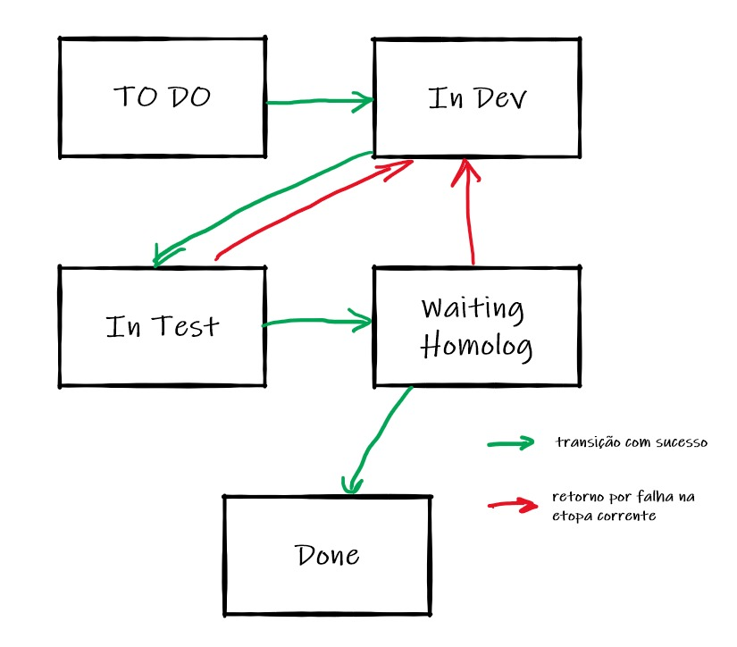

# Case de Avaliação Hackathon-TI - Qualidade

## O Desafio
Criar um processo para garantia da qualidade em empresa de software
### O problema
A empresa XY Sistemas desenvolve sistemas de gestão integrada (ERPs). Nos últimos 5 anos, as equipe de desenvolvimento passo de 4 para 45 pessoas e a carteira de clientes passou de 2 para 125 empresas. Atualmente, o ERP desenvolvido roda o banco de dados MSSQL Server e servidor de aplicações Apache Tomcat 8.5, onde estão hospedados tanto os webservices quanto os componentes da lógica do sistema. A camada de apresentação foi construída com HTML e JQuery. Ocorre que o número de falhas no software vem aumentando e está causando impacto e insatisfação junto aos clientes. Inclusive, alguns contratos já foram rescindidos. Sua missão é criar um processo de garantia da qualidade, com o objetivo de reverter a situação atual, buscando maior qualidade e, consequentemente, satisfação junto aos clientes da XY Sistemas.
### Os requisitos
1. Crie os processos e os documente, justificando a importância de cada atividade.
2. Determine as tecnologias, sistemas, softwares e quaisquer elementos que considere importantes para o processo de garantia da qualidade na XY Sistemas.
3. Determine os papéis a serem desempenhados para o processo que você está propondo.
4. Todas as suas decisões e escolhas devem ser justificadas na documentação do projeto
5. Todos os artefatos desenvolvidos devem ser disponibilizados para análise técnica
## A Solução Proposta

### Premissas
1. A XY sistemas desenvolve ERPs em formato Ágil, utilizando o Scrum.
2. O quadro de desenvolvedores será dividido em times (_squads_) de, no máximo 9 pessoas.
3. A XY Sistemas contratará Scrums Masters e Product Owners para compor esses _squads_.
4. A XY Sistemas contratará ao menos um profissional de Quality Assurance para cada uma das _squads_.

### Papéis:
* Agile Master: pessoa responsável por atuar como facilitador do Scrum, removendo quaisquer obstáculos que sejam levantados pela equipe durante as dailies.
* Product Owner: pessoa responsável por definir os itens que serão tratados pelo time e os prioriza nas reuniões de planejamento (Planning)
* Desenvolvedores: pessoas responsáveis por executar o desenvolvimento, resolver problemas e garantir a entrega;
* Testers (QAs): pessoa responsável por garantir que os requisitos foram atendidos e que o padrão de qualidade do que foi desenvolvido está dentro do esperado.

### Pontos de Melhoria
#### Monitoria de Infra
Adicionar as seguintes monitorias de disponibilidade de infraestrutura:
*Disponibilidade do servidor Apache Tomcat: pings a cada 10s no endereço da aplicação
*Disponibilidade do servidor MSSQL Server: query simples submetida a cada 10s.
*Estabelecer parâmetros de qualidade para essas monitorias, como percentual de tempo disponível por tempo absoluto, por exemplo, que indicará a consistência dos serviços prestados.

#### Etapas de Qualidade durante os desenvolvimentos
Assumindo a premissa de que os desenvolvedores da XY Sistemas trabalham em formato Ágil, metodologia SCRUM, temos duas sugestões para melhorar a qualidade do que é produzido:

1. Introduzir testes unitários da camada de aplicação HTML + JQuery utilizando o QUnit. 
Uma tarefa só pode ser passada do status “In Dev” para o status “In Test” uma vez que o desenvolvedor tenha garantido a qualidade unitária dos desenvolvimentos feitos, garantindo a qualidade das regras de negócio. Idealmente, o time faria uso de TDD, metodologia de desenvolvimento orientada a testes (vide seção Métodos).
2. Introduzir testes integrados para os webservices e camada de aplicação. Esses testes serão conduzidos pela figura do QA (ver a seção Papeis) com base em requisitos e condições de aceite (ver seção Métodos). As ferramentas utilizadas para isso serão o Postman (para validação de webservices) e Planos de Teste (para a validação da camada de Aplicação); esses planos de teste são embasados na metodologia BDD (vide seção Métodos).

### Ferramentas
1. *Google Docs*: por sua eficácia em fazer alterações simultâneas em uma única plataforma, dessa forma melhorando a comunicação com todos os times. Será utilizado para documentar os desenvolvimentos (requisitos, regras de negócio, critérios de aceite e solicitações de alterações) em documentos padronizados.
  1. Documento de Solicitação de Mudança: será gerada pela área demandante (ou cliente) especificando a alteração que julga necessária para o sistema ou módulo em questão, bem como os critérios de aceite.
  2. Documentos de Aceite: serão assinados pelas áreas demandantes (ou clientes), reconhecendo que a _feature_ solicitada está entregue como esperado, atendendo aos requisitos e respeitando os critérios de aceite.

2. *Postman*: ferramenta que permite testes automatizados de APIs e Webservices. A automatização de testes básicos de webservices garante uma maior uniformidade nos testes (e nos desenvolvimentos) e maior qualidade sem aumento significativo do tempo de teste.

3. *QUnit*: automação de testes unitários de código desenvolvido em JQuery. Permite testes de regras de negócio.

4. *JIRA*: sistema de controle de tickets (bugs ou features) que servirá como estrutura de controle de trabalho em andamento

###  Método
Utilizaremos dois métodos de trabalho complementares: o PDCA, como embasamento teórico de melhoria contínua do ERP da XY Sistemas, bem como do melhoramento contínuo do trabalho das equipes de desenvolvimento. Para praticarmos essa melhoria contínua, utilizaremos o método Scrum de desenvolvimento, separando as demandas em _sprints_ (de 2 a 4 semanas), que contém reuniões que atendem o nosso embasamento teórico: a reunião de _planning_ nos permite entender o que deve ser feito, as reuniões diárias (_dailies_) para acompanhamento das atividades dentro da _sprint_ e, ao final, as reuniões de checagem: _review_ e _retrospective_. Essas últimas servem para a avaliar a qualidade final do produto entregue e também a qualidade dos processos internos do time de desenvolvimento.

Para pautar os desenvolvimentos e os testes, utilizaremos dois tipos de _framework_: TDD e BDD.

O TDD (_Test Driven Development_) será utilizado para garantir qualidade no nível unitário e será responsabilidade do desenvolvedor. 

O BDD (_Business Driven Development_) será utilizado para garantir qualidade em nível integrado e sua execução será de responsabilidade do QA.

## Processos
Todos os desenvolvimentos devem ser atendido em Sprints (de 2 a 4 semanas).
Durante uma sprint um desenvolvimento passa pelos seguintes status:

O que cada status representa:
TO DO: tarefa está aguardando ser iniciada
In Dev: tarefa está em desenvolvimento
In Test: tarefa foi desenvolvida e está em teste
Waiting Homolog: a tarefa foi aprovada nos testes do time e está aguardando a aprovação do cliente
Done: tarefa concluída.

Caso a tarefa seja reprovada nas etapas de teste ou de homologação, esta será devolvida para o desenvolvedor e o status volta a ser “In Dev”.

